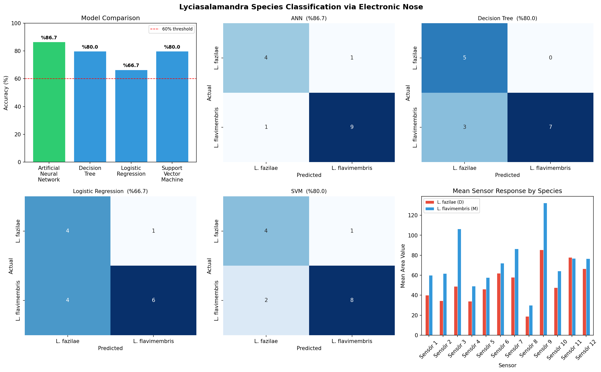

# 🦎 Classification of *Lyciasalamandra flavimembris* and *Lyciasalamandra fazilae* by Electronic Nose

> **Classification of Marmaris Lycian Salamander, *Lyciasalamandra flavimembris* (Mutz & Steinfartz, 1995)(Amphibia: Urodela) and Göcek Lycian Salamander, *Lyciasalamandra fazilae* (Başoğlu & Atatür, 1974) by Electronic Nose**

ML-based species classification of two endangered endemic salamander species using electronic nose odor data.

---

## 🏆 Recognition

- 🥇 **1st Place in Turkey** — MEF Research Competition, Biology Category (2023)
- 🌍 **Accepted for Poster Presentation** — [22nd European Congress of Herpetology](https://www.sehcongress23.com), University of Wolverhampton, UK, 4–8 September 2023

---

## 🧬 Overview

Two closely related, endangered salamander species endemic to Turkey's southwestern Anatolia —
*Lyciasalamandra flavimembris* (Marmaris Salamander) and *Lyciasalamandra fazilae* (Göcek Salamander) — are traditionally distinguished through morphological, ecological, or molecular methods, all of which require invasive procedures, significant time, and high cost.

This study investigated whether the two species could instead be distinguished through their **pheromone scent signatures alone**, using an electronic nose (e-nose) system paired with machine learning classifiers — a novel, non-invasive approach with no prior precedent in vertebrate species discrimination at this taxonomic level.

---

## 🦎 Species

| Species | Common Name | IUCN Status | Distribution |
|---------|------------|-------------|-------------|
| *Lyciasalamandra flavimembris* | Marmaris Salamander | EN (Endangered) | Köyceğiz–Marmaris–Muğla corridor |
| *Lyciasalamandra fazilae* | Göcek Salamander | EN (Endangered) | Sultaniye/Köyceğiz – İncirköy/Fethiye, up to 1060 m altitude |

Both species are nocturnal, active primarily during rainy periods between November and April, and rely heavily on olfactory cues for navigation, mate recognition, and territorial behavior.

---

## 🔬 Methodology

### 1. Biological Sample Collection
- **25** *L. flavimembris* specimens from Marmaris; **23** *L. fazilae* from Gökbel Village (Dalyan)
- Each specimen housed individually in a sealed container with natural habitat soil, moss, and earthworms
- Animals left undisturbed for **18 hours** to allow pheromone accumulation
- All specimens returned to their exact collection sites on day 3, unharmed
- Conducted under permits from the Ministry of Nature Conservation and Aydın Adnan Menderes University Ethics Committee

### 2. Electronic Nose Measurements
- **Device:** DiagNose 2 — 12-sensor e-nose system, EPO Software
- Each cycle: **5 min** sampling + **1 min** air purge = 6 min/sample
- Data exported via Enose Data Reader → **24 CSV files**

### 3. Data Processing
- **576 total sensor readings** (48 specimens × 12 sensors)
- Min-max normalization:

$$V_b = \frac{V_i - V_{min}}{V_{max} - V_{min}}$$

- Area under sensor curve via **Trapezoidal Rule**: `=(B1+B2)/2*(A2-A1)` summed at 5-min intervals
- Final feature matrix: **48 × 12**

### 4. Classification Models

70% training / 30% test split — Python, Pandas, Scikit-learn.

| Model | Accuracy |
|-------|:--------:|
| **Artificial Neural Networks (MLP)** | **86.67%** |
| Decision Trees | 80.00% |
| Support Vector Machines | 80.00% |
| Logistic Regression | 66.67% |

All four models exceeded the 60% threshold confirming inter-species pheromonal difference.

---

## 📊 Results



---

## 🪧 Conference Poster

*Presented at the 22nd European Congress of Herpetology, Wolverhampton, UK — September 2023*

---

## 🗂️ Repository Structure

```
├── data/
│   └── Semender.csv                  # 48 specimens × 12 sensor features + species label
├── results/
│   └── classification_results.png   # Auto-generated: model comparison + confusion matrices
├── classify.py                       # Full ML pipeline — reproduces all original results
├── poster.png                        # SEH 2023 conference poster
├── requirements.txt
└── README.md
```

---

## 🚀 Running the Code

```bash
git clone https://github.com/YOUR_USERNAME/YOUR_REPO.git
cd YOUR_REPO
pip install -r requirements.txt
python classify.py
```

Prints accuracy scores and saves the results figure to `results/`.

---

## 📌 Key Findings

- ANN correctly classified **~87 out of every 100 specimens** based on scent alone
- **First evidence** that e-nose technology can discriminate between closely related vertebrate species using pheromonal signatures — without morphological or genetic analysis
- Results suggest pheromonal differences between the two species that could serve as a novel taxonomic discriminator

---

## 🔭 Future Directions

- Increasing sample size to push classification accuracy toward 100%
- Mobile e-nose systems for in-field species identification
- Extending the method to snakes, lizards, and cartilaginous fish
- Integration with cloud databases and smartphone interfaces

---

## 🛠️ Tools & Technologies

| Category | Tools |
|----------|-------|
| Data collection | DiagNose 2, EPO Software, Enose Data Reader |
| Data processing | Microsoft Excel (Trapezoidal Rule, min-max normalization) |
| Machine learning | Python, Pandas, Scikit-learn |
| Visualization | Matplotlib, Seaborn |

---

## 👥 Authors

Muhammed Çağan Göktaş · Mina Akın · Hülya Olgun · Kurtuluş Olgun · Ünal Kızıl

---

## 📄 Citation

> Göktaş M.C., Akın M., Olgun H., Olgun K., Kızıl Ü. (2023). *Classification of Marmaris Lycian Salamander, Lyciasalamandra flavimembris and Göcek Lycian Salamander, Lyciasalamandra fazilae by Electronic Nose.* Poster presented at the 22nd European Congress of Herpetology, University of Wolverhampton, UK, 4–8 September 2023.
